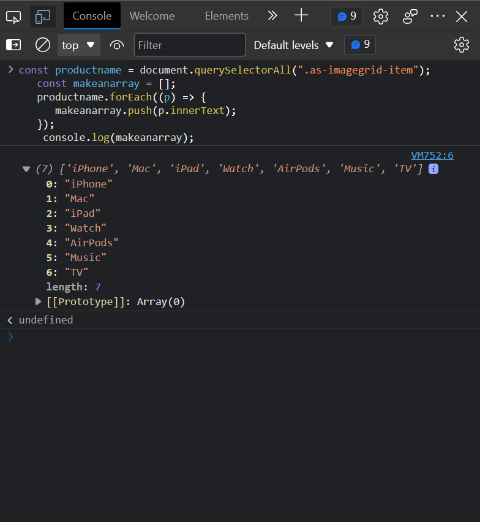

**2.Websit Name: [Apple](https://support.apple.com/en-in)**

## Sample Image

.png)

## Task

***Fetch all the product name and store in an arry***

- ['iPhone', 'Mac', 'iPad', 'Watch', 'AirPods', 'Music', 'TV']

## Code used 

*const productname = document.querySelectorAll(".as-imagegrid-item");
    const makeanarray = [];
    productname.forEach((p) => {
      makeanarray.push(p.innerText);
   });
    console.log(makeanarray);*

## Output

