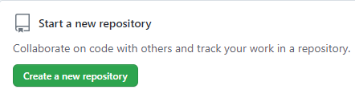

**12. Webiste Name: [Github](https://github.com/)**

## Topics

  ***querySelector,style,background-Color***

## Sample Image

## Tasks

**change the background colour of the button to blue.**

## Code used

  document.querySelector(".btn-primary btn").style.backgroundColor = "blue";

## Output

.png)