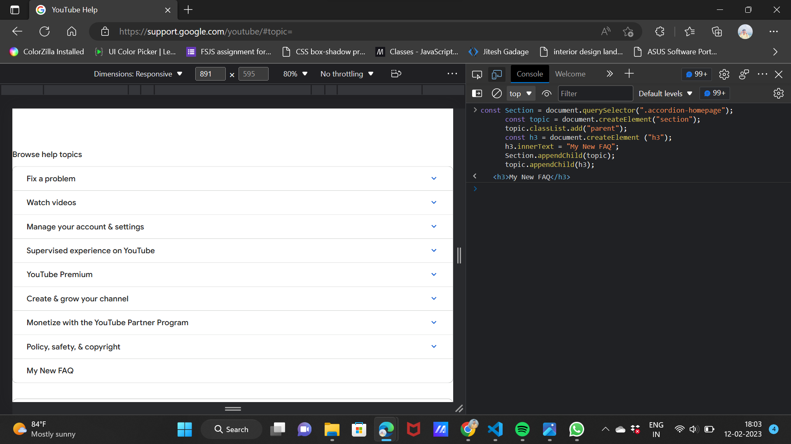

**3. Website Name: [Youtube](https://support.google.com/youtube/)**

## Topics

 **Get Element By Id, Create Element, create Text Node, Append Child.**

## Sample Image

.png)

## Task 

***Add another FAQ 'My New FAQ' to the list***

## Code used

          const Section = document.querySelector(".accordion-homepage");
          const topic = document.createElement("section");
          topic.classList.add("parent");
          const h3 = document.createElement ("h3");
          h3.innerText = "My New FAQ";
          Section.appendChild(topic);
          topic.appendChild(h3);

## Output

