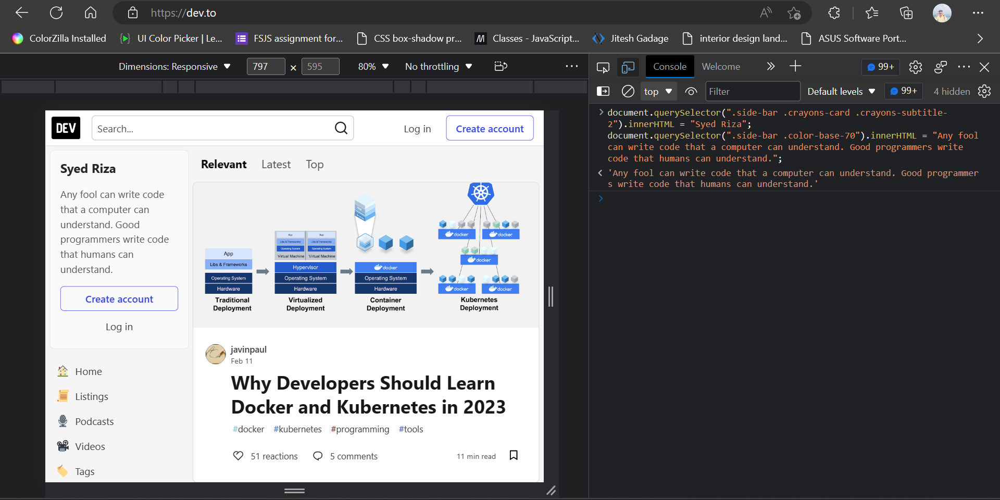
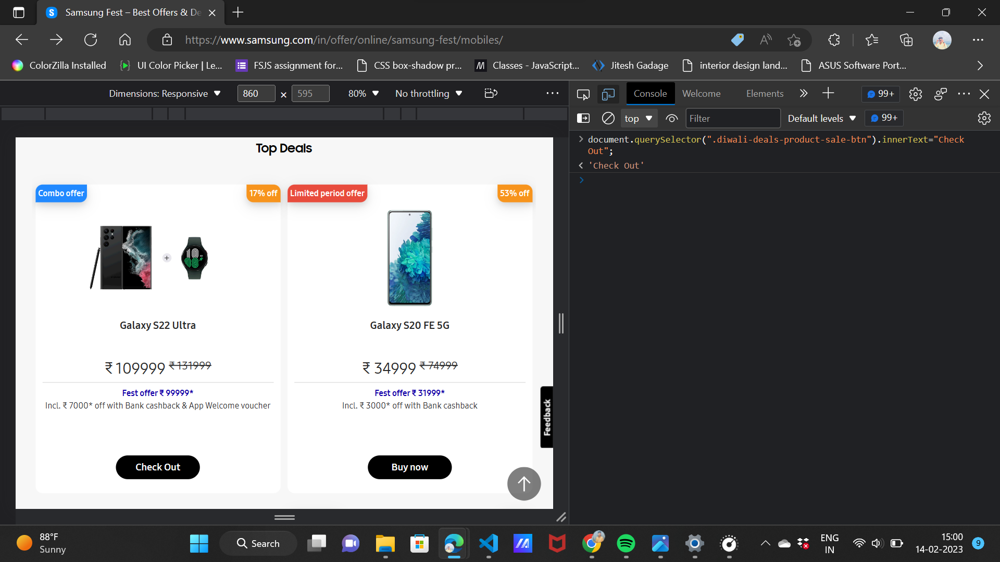

# DOM Manipulation Assignment 

**1. Website Name: [Dev To](https://dev.to/)**

## Topics

   - Query Selctory, Inner HTML

## Sample Image 

.png)

## Tasks 

  ***Target the Top description div and change the DEV community to <your_Name> and description to your passion.***

## Code uesd
 
*document.querySelector(".side-bar .crayons-card .       crayons-subtitle-2").innerHTML = "Syed Riza";
document.querySelector(".side-bar .color-base-70").innerHTML = "Any fool can write code that a computer can understand. Good programmers write code that humans can understand.";*

## Output 

**2.Websit Name: [Apple](https://support.apple.com/en-in)**

## Sample Image

.png)

## Task

***Fetch all the product name and store in an arry***

  -['iPhone', 'Mac', 'iPad', 'Watch', 'AirPods', 'Music', 'TV']

## Code used 

*const productname = document.querySelectorAll(".as-imagegrid-item");
    const makeanarray = [];
    productname.forEach((p) => {
      makeanarray.push(p.innerText);
   });
    console.log(makeanarray);*11

## Output

**3. Website Name: [Youtube](https://support.google.com/youtube/)**

## Topics

 **Get Element By Id, Create Element, create Text Node, Append Child.**

## Sample Image

.png)

## Task 

***Add another FAQ 'My New FAQ' to the list***

## Code used

       const Section = document.querySelecto("accordion-homepage");
      const topic = document.createElement("section");
      topic.classList.add("parent");
      const h3 = document.createElement ("h3");
      h3.innerText = "My New FAQ";
      Section.appendChild(topic);
      topic.appendChild(h3);
## Output

**4. Website Name: [Oneplus](https://www.oneplus.in/support)**

## Topics

***Query Selector, Innertext***

## Sample Image

.png)

## Output 

   document.querySelector(".customer-support a").innerText = '+91 7204022364'

## Tasks

***Change the contact Number***

## Output

**5. Website Name: [Samsung](https://www.samsung.com/in/offer/online/samsung-fest/)**

## Topics

***getElementId, cerateElement, InnerText, append, setAttribute.***

## Sample Image 

.png)

## Code used

    document.querySelector(".diwali-deals-product-sale-btn").innerText = "Check Out";

## Tasks 

***Target the main div of card and change the Button text to check out.***

## Output 

**6. Website Name: [Adidas](https://www.adidas.co.in/)**

## Topics 

 - ***Query selector, Event Listeners, Changing Styles.***

## Sample Image 

.png)

## Code uesd
    
    const find = document.querySelector("._wrapper_1f3oz_1 ._input_1f3oz_13")
  find.addEventListener("mouseover", changbg)
  function changbg(){
  find.style.backgroundColor = "red"
  };

## Tasks 

**Target the search box and on hover change the background to red.**

## Output 

**7. Website Name: [MDN Web Docs](https://developer.mozilla.org/en-US/)**

## Topics 

***From, Value, Submit.***

## Sample Image 

.png)

## Tasks 
**To Search a topic in the MDN Search bar. First add a text to search in the search bar and then hit submit search button to search the docs using DOM.**

## Output

**8. Website Name: [Google](https://www.google.com/)**

## Topics 

***Remove Elements***

## Sample Image 

.png)

## Tasks

**Remove alternate languages from the home page langanges listed**

## Code used
 
     const languagesOffered = document.querySelectorAll('#SIvCoba')
     languagesOffered.forEach( (a, i)=> i%2==0 && a.remove())

## Output 

**9. Website Name: [Code War](https://www.codewars.com/)**

## Topics 

***Change Font Family, Color of Text.***

## Sample Image 

.png)

## Tasks
**Change the font family of the text to monosapce and text color 
  to the logo's background color.**

## Code used

document.querySelector('.text-color-white').style.fontFamily ="monospace"
    document.querySelector('.text-color-white').style.color="#B1361E"

## Output

**10. Website Name: [Freecodecamp](https://www.freecodecamp.org/)**

## Topics

***queryselector, mouseover, click eventlister, callback function, style.***

## Sample Image

.png)

## Tasks 

**Target the button and change background color on mouseover**

## Code used

     document.querySelector(".btn-cta-big .login-btn-text ").addEventListener("mouseover",function(){

  document.querySelector(".btn-cta-big .login-btn-text ").style.backgroundColor="red"

## Output

**11. Website Name: [Realme](https://www.realme.com/in/)**

## Topics

***queryselector, style, background-image***

## Sample Image

.png)

## Tasks 

**change the realme logo to ineuron logo**

## Code used

  document.querySelector(".gtag .icon").style.backgroundImage="url('https://ineuron.ai/images/ineuron-logo.png')"

## Output

**12. Webiste Name: [Github](https://github.com/)**

## Topics

***querySelector,style,background-Color***

## Sample Image

## Tasks

**change the background colour of the button to blue.**

## Code used

   document.querySelector(".btn-primary btn").style.backgroundColor = "blue";

## Output

.png)

**13. Webiste Name: [Hackerrank](https://www.hackerrank.com/)**

## Topics

  ***querySelector, innerHTML***

## Sample Image

## Tasks

  **Traget the top description and change "Everything you need to know to hire Software Engineers" to "JSBOOTCAMP.**

## Code used

    document.querySelector('.fl-heading').innerHTML = "JSBOOTCAMP";

## Output

**14. Webiste Name: [Asus](https://www.asus.com/in/)**

## Topics

  ***querySelector,style,font-size***

## Sample Image

.png)

## Tasks

  **change the fontsize of “Hot Deals” to 80px**

## Code used

      document.querySelector('.HotDealsAll__Heading__2fIbe').style.fontSize="80px";

## Output

**14. Webiste Name: [Dell](https://www.dell.com/en-in/shop/deals/laptop-deals?gacd=10415953-9016-5761040-285981356-0&dgc=ST&gclid=Cj0KCQjwguGYBhDRARIsAHgRm4-XUDMhhVNyHXb3s1gY4ZBzORr_d9Se-buhJwy7asyUe7YdqEA11eEaAt6UEALw_wcB&gclsrc=aw.ds&nclid=BxjBlpBQsX6pjSHh-L8YYSU77EpfXRkG1AGMB5Wbeu386ykspfrPDnfx_DdFau20)**

## Topics

  ***querySelector, style, textAlign***

## Sample Image

.png)

## Tasks

  **Convert the text "G15 Gaming Laptop" from left to right**

## Code used

     document.querySelector(".ps-title").style.textalign= "right"; 

## Output

**16. Webiste Name: [Vercal](https://vercel.com/)**

## Topics

***querySelector, innerHTML***

## Sample Image

## Tasks

**change the heading "Build when inspiration strikes" to "start with scratch"**

## Code used

  document.querySelector('.section-title_title__VEDfK').innerHTML = "Start with Sctrach";

## Output

**17. Webiste Name: [Sony](https://www.sony.co.in/)**

## Topics

***querySelector, innerHTML***

## Sample Image

.png)

## Tasks

**Change the button text to current Date**

## Code used

  document.querySelector(".btn-container").innerHTML=new Date()

## Output

**18. Webiste Name: [Philips](https://www.philips.co.in/)**

## Topics

***querySelector, style, backgroundcolor***

## Sample Image

.png)

## Tasks

**Change the background color blue to orange**

## Code used

  document.querySelector(".p-f03-footer-container .p-footer").style.backgroundColor="orange"

## Output

**20. Webiste Name: [Oppo](https://www.oppo.com/in/)**

## Topics

***querySelector, style, color***

## Sample Image

.png)

## Tasks

**Change the description color black to orange**

## Code used

     document.querySelector('.product-card-content .desc').style.color = 'Orange';

## Output

